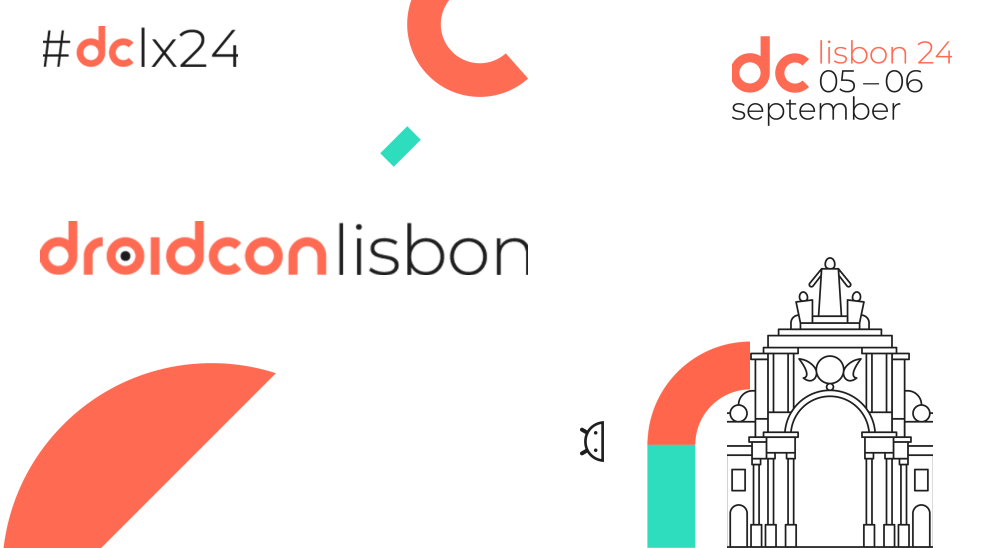

# Kotlin Simple Processing

This is the companion demo app for the **Kotlin Simple Processing** session at DroidCon Lisbon

## Project Structure

You will find the KSP annotations in the `annotation` module and the KSP processors in the 
`processor` module.

The `library` module contains some general purpose code including the `ContentResolver` and the Koin
extensions that support the demo app.

The demo app is located in the `app` module.